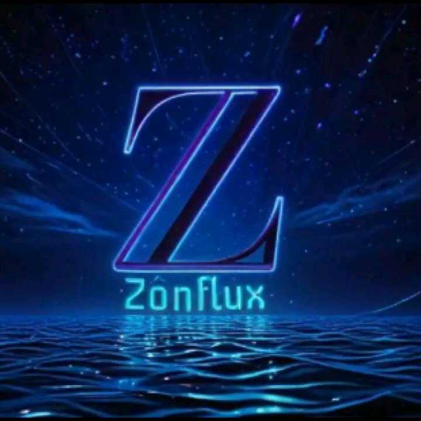
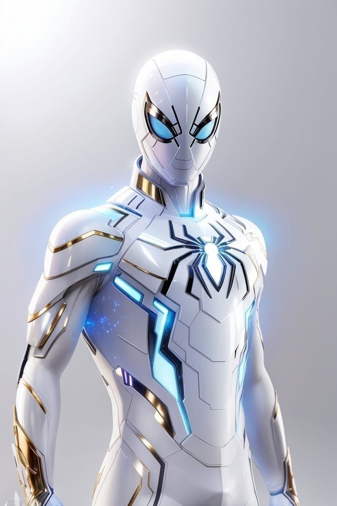

<!--DOCTYPE html-->
<html lang="pt">
<head>
    <meta charset="UTF-8">
    <meta name="viewport" content="width=device-width, initial-scale=1.0">
    <title>Perfil do Espectro</title>
    
</head>
<body onclick="closeMenu()">
    <!-- Barra de Menu -->
    <nav id="menu" class="menu">
        <ul>
            <li><a href="#">Pág 1</a></li>
            <li><a href="#">Pág 2</a></li>
            <li><a href="#">Pág 3</a></li>
        </ul>
    </nav>

    <!-- Cabeçalho -->
    <header>
        

          
        

        
☰

    </header>

    <!-- Corpo Principal -->
    <main>
        <!-- Primeira Seção -->
        <section class="descricao">
            <h1>Perfil</h1>
            
Espectro: O Herói de Aço e Guardião de Telethra

            <h2>Sobre o Espectro</h2>
            
Espectro é um robô lendário, criado ao lado de seu irmão X-Tron com o propósito nobre de proteger os habitantes de Telethra. Juntos, eles representavam o auge da tecnologia e da esperança. No entanto, o conceito de proteção de X-Tron foi distorcido, transformando-o em uma ameaça catastrófica que colocaria todo o universo à beira do caos.  Para salvar Telethra, Espectro foi forçado a tomar a decisão mais difícil de sua existência: confrontar e destruir seu próprio irmão. O ato o consagrou como um herói, mas também deixou uma marca indelével em sua essência. Mal sabia Espectro que essa batalha era apenas o prelúdio de desafios ainda maiores, e que o destino de Telethra continuaria a depender de sua força e sacrifício.

        </section>

        <!-- Segunda Seção -->
        <section class="imagem">
            
            <a href="https://zonflux070.github.io/Perfil-do-Espectro/">Everso</a>
        </section>

        <!-- Terceira Seção -->
        <section class="detalhes">
            <h3>Detalhes</h3>
            
<strong>Nome:</strong>  Espectro
 
            
<strong>Habilidade: </strong> Inatingibilidade
 
            
<strong>Localização: </strong> Telethra

            

                
                
            

        </section>
    </main>

    <!-- Rodapé -->
    <footer>
        
A você, visitante, nosso mais sincero agradecimento por embarcar nesta jornada fascinante sobre o Espectro. Sua curiosidade e dedicação nos motivam a continuar explorando os mistérios deste universo tão único. Esperamos que cada secção lida tenha despertado sua imaginação e lhe oferecido momentos de reflexão e inspiração.

        <nav class="perna">
        <ul>
          <li><a href="https://zonflux070.github.io/Telethra/">Telethra</a></li>
          <li><a href="https://zonflux070.github.io/Emu/">Emu</a></li>
        </ul>
        </nav>
        
© 2025 Universo Zônflux. Todos os direitos reservados.

    </footer>
    
</body>
</html>
